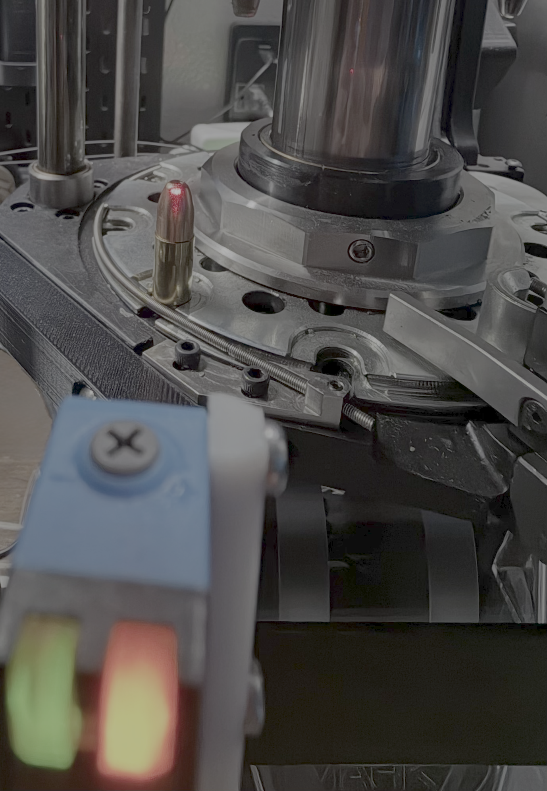
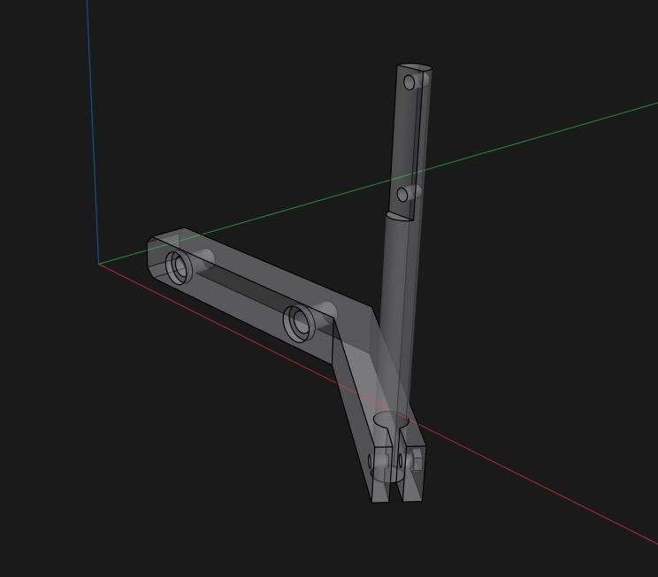
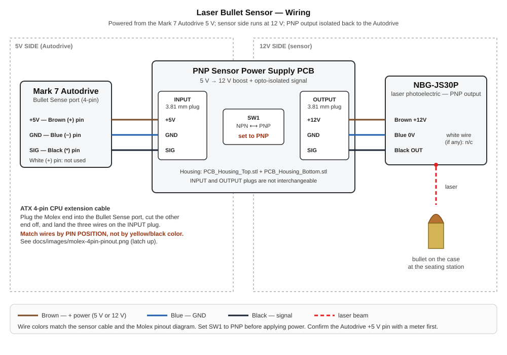
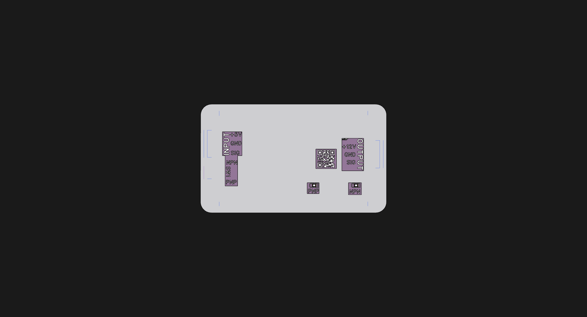
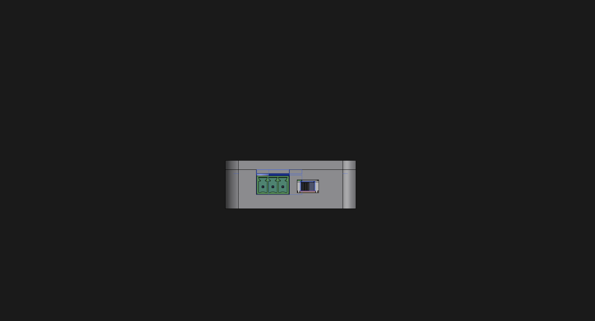
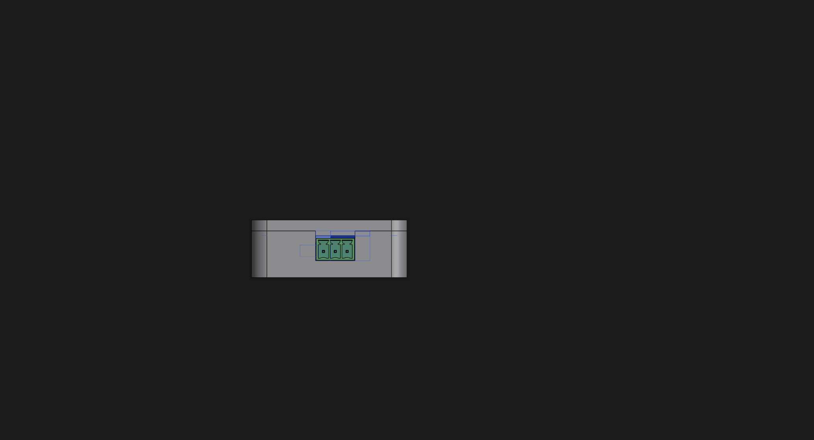
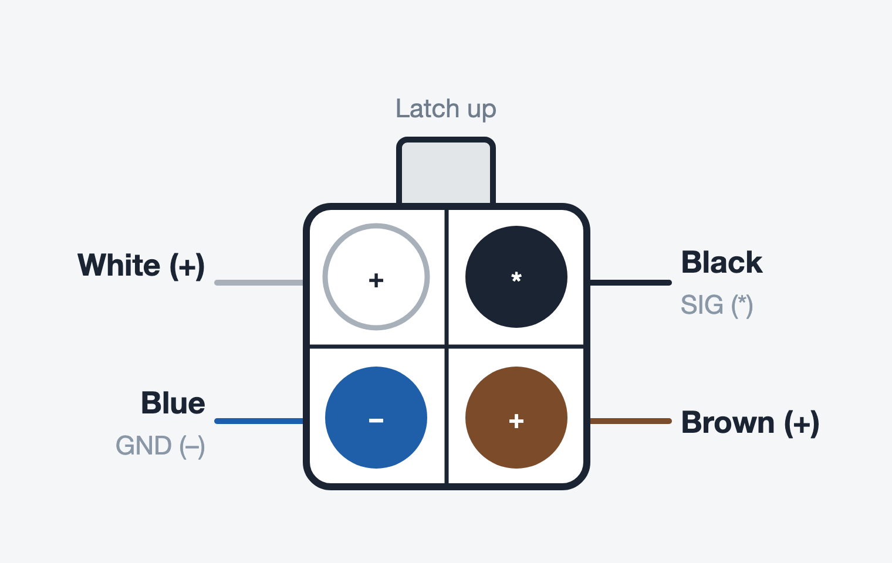

# Laser Bullet Sensor

A DIY **laser bullet presence / orientation sensor** for **Mark 7 Autodrive** progressive presses (Apex 10, Evolution, and other Autodrive-equipped machines). A background-suppression laser photoelectric sensor sits on a 3D-printed bracket and looks across the shell plate at the bullet on the case at the seating station. If there's no bullet — or it's sitting wrong — the sensor flips its output and the Autodrive stops the press with an **ERROR** on the tablet before it indexes to the next station.

It's a DIY alternative to a commercial bullet sensor, built from off-the-shelf parts and **four 3D-printed pieces**:

- **Laser Bullet Sensor Bracket** — bolts to the press body and clamps the linear rod.
- **Laser Bullet Sensor Linear Rod** — the post the sensor mounts to; slides and rotates in the bracket clamp for height and aim.
- **PCB Housing (Top + Bottom)** — the box for the **PNP Sensor Power Supply PCB**, with cutouts for the INPUT / OUTPUT plugs and the PNP/NPN switch.

> ⚠️ **This is a hobbyist project shared as-is, with no warranty.** A DIY sensor is a backstop, not a substitute for safe reloading practice and visual inspection. Test thoroughly with dummy/empty cases before live loading, and follow Mark 7's guidance for wiring anything into your press. You are responsible for your own machine and your own safety.

> 👁️ **Laser safety.** The sensor emits a visible red laser. Don't stare into it, don't aim it at eye level while you're setting it up, and do your alignment with the press stopped.

---

## Video guide

Four short videos walk through the whole thing. They're linked again in the sections they cover. Playlist: [tinyurl.com/BulletSensor](https://tinyurl.com/BulletSensor)

| | |
|---|---|
|  **1. Unboxing and initial setup overview** |  **2. Mounting options on the Mark 7 press** |
|  **3. Testing the Sensor** |  **4. Adjusting Sensor detection distance** |

---

## Ways to build it

This is documented to be built yourself. Every commodity component is off-the-shelf and linked in the [bill of materials](#bill-of-materials), all four printed parts are in [`hardware/`](hardware/) as STL files, and the wiring is spelled out end to end. The one piece you get from me is the **PNP Sensor Power Supply PCB** — the boost/isolation board that sits between the press and the sensor — sold assembled because it's the part that's genuinely fiddly to source and build on your own.

If you'd rather skip the printing and crimping altogether, the whole thing is also available built and tested. Two ways to go:

| Level | You supply | You buy ready-made |
|---|---|---|
| **DIY** | The commodity parts (sensor, cables, terminal plugs, screws) ordered from the BOM links, all four pieces printed on your own machine, the wiring and tuning | The [PNP Sensor Power Supply PCB](https://go.khcprecision.com/PNP_PCB), assembled |
| **Assembled** | Bolting it to your press and dialing in the distance | A complete, built and tested sensor — what you see in the [unboxing video](https://youtu.be/-Qg1wYBSL-w) |

**Store:** the parts for this build have live **Add to cart** buttons right under this design on [khcprecision.com/diy](https://khcprecision.com/diy); individual parts are also in the [**Parts** section](https://khcprecision.com/store#parts) of the store. Inventory shown on the site is live and I keep it stocked as best I can; orders generally ship within **2–4 business days**.

---

## How it works

The **NBG-JS30P** is a *background-suppression* diffuse photoelectric sensor: it fires a visible red laser at the target and uses triangulation to decide whether something is inside its set distance window (adjustable from about **20 to 300 mm**), largely regardless of the object's colour. Aimed across the shell plate at the seating station, a bullet sitting on the case mouth falls inside the window; an empty case mouth, a missing bullet, or a bullet lying sideways doesn't. The sensor has a **PNP** (sourcing) output — when it sees the bullet, its black output wire is pulled up to the sensor supply voltage.

The sensor wants **10–30 VDC** and the Autodrive sensor port only offers **5 V**, so there's a small board in between. The **PNP Sensor Power Supply PCB** takes the Autodrive's 5 V on its **INPUT** plug, boosts it to **12 V** for the sensor on its **OUTPUT** plug, and passes the sensor's PNP output back through an **opto-isolator** to the Autodrive's SIG line — so the sensor side and the press electronics never share a direct electrical path. The board has a small slide switch, **SW1**, that selects **NPN** or **PNP** sensor logic. **This build uses a PNP sensor, so SW1 must be on PNP before you power it up.**

On the press side, the board plugs into the Autodrive's **Bullet Sense** port, and you enable **Bullet Sense** on the tablet. From then on the Autodrive treats it like the factory sensor: a fault stops the press and throws an error.

---

## Bill of materials

Part links go to **Amazon** for commodity components and to **[KHC Precision](https://khcprecision.com/diy)** for the PCB — see [Ways to build it](#ways-to-build-it). Source them wherever you like; nothing is proprietary.

| # | Part | Qty | Notes |
|---|------|-----|-------|
| 1 | **PNP Sensor Power Supply PCB** (assembled) — [link](https://go.khcprecision.com/PNP_PCB) *(KHC Precision)* | 1 | 5 V in → 12 V out, opto-isolated signal, SW1 NPN/PNP switch. Fits the PCB Housing in `hardware/` |
| 2 | **NBG-JS30P** background-suppression laser photoelectric sensor — [link](https://www.amazon.com/dp/B0GX4SXS33) | 1 | 20–300 mm, 10–30 VDC. ⚠️ **Must be the PNP "JS30P" version** — the NPN "JS30N" will not work with this wiring. Comes with 2 mounting screws and 2 nuts; you'll use all of them |
| 3 | 3-pin **3.81 mm right-angle pluggable screw terminal block** — [link](https://www.amazon.com/dp/B0CN8ZY184) | 2 (sold as a pack of 20) | One pushes into the PCB's **INPUT** side, one into the **OUTPUT** side |
| 4 | **ATX 4-pin CPU extension cable** — [link](https://www.amazon.com/dp/B01DV1Z36A) | 1 (sold as a 2-pack) | Plugs into the Autodrive's Bullet Sense port; the other end gets cut off and landed on the INPUT plug. See [Wiring](#2-wiring) |
| 5 | **1/4-20 × 3/4" button head socket cap screws** — [link](https://www.amazon.com/dp/B07TJN6L2J) | 2 (sold as a pack of 25) | Mount the bracket to the press body |
| 6 | **M3 × 20 screw** | 1 | With **one of the two nuts included with the sensor** — provides adjustable clamp tension on the bracket where it grips the linear rod |
| 7 | Sensor's **included screws** (2) | — | Mount the sensor to the linear rod |
| 8 | **Laser Bullet Sensor Bracket** (3D printed) | 1 | `hardware/Laser Bullet Sensor Bracket.stl` |
| 9 | **Laser Bullet Sensor Linear Rod** (3D printed) | 1 | `hardware/Laser Bullet Sensor Linear Rod.stl` |
| 10 | **PCB Housing Top + Bottom** (3D printed) | 1 each | `hardware/PCB_Housing_Top.stl`, `hardware/PCB_Housing_Bottom.stl` |

> The components are third-party products sold under their own terms. This project only covers the printed parts, wiring, and documentation.

**What's in the kit** (the Assembled option): the sensor with its cable already landed on an OUTPUT plug, the printed bracket and rod, the sensor's screws and nut, the PCB in its housing, and a pre-made Autodrive cable (Molex on one end, INPUT plug on the other). The [unboxing video](https://youtu.be/-Qg1wYBSL-w) goes through all of it.

---

## 1. Print the parts

All four parts are in [`hardware/`](hardware/) as STL files, modeled in millimetres:

- `Laser Bullet Sensor Bracket.stl` — the arm that bolts to the press, with a split clamp at the end for the rod.
- `Laser Bullet Sensor Linear Rod.stl` — the post the sensor screws to.
- `PCB_Housing_Top.stl` / `PCB_Housing_Bottom.stl` — the box for the power supply PCB.

- **Material:** PETG or ABS/ASA recommended for stiffness and proximity to the press; PLA works for bench testing.
- **Suggested settings:** 0.2 mm layers, 5 Walls, 20–30% infill. The bracket and rod carry the sensor's weight and get clamped, so don't skimp on perimeters.
- Print the bracket flat on its long face and the rod on its side so the clamp bore and the sensor holes come out round; add supports only if your orientation needs them.
- Test-fit the rod in the bracket clamp, the sensor screws in the rod, and the PCB in the housing before final assembly. Tune your slicer's hole/horizontal-expansion compensation if anything is tight.

---

## 2. Wiring

**Signal chain:** Autodrive Bullet Sense port (5 V) → **INPUT** plug → PNP Sensor Power Supply PCB (boost to 12 V) → **OUTPUT** plug → NBG-JS30P → laser → bullet; NBG-JS30P PNP output → PCB (opto-isolator) → Autodrive SIG.

Six wires total, three on each plug. The lid of the PCB housing is your reference for which side is which:

| INPUT side | OUTPUT side |
|---|---|
|  |  |

### Sensor → OUTPUT plug

Land the sensor's cable on one of the 3.81 mm plugs and push it into the **OUTPUT** side. Standard sensor colours:

| OUTPUT terminal | Sensor wire |
|---|---|
| **+12V** | Brown |
| **GND** | Blue |
| **SIG** | Black (PNP output) |

If your sensor has a fourth (white) wire, leave it insulated and unconnected.

### Autodrive → INPUT plug

The Autodrive's Bullet Sense port is a 4-pin Molex (Mini-Fit Jr style, same as an ATX CPU power plug). You have two ways to get from there to the INPUT plug:

- **Easy:** take the [ATX 4-pin CPU extension cable](https://www.amazon.com/dp/B01DV1Z36A), plug its Molex end into the Bullet Sense port, and **cut the other connector off**. Land three of the four wires on a 3.81 mm plug and push it into the **INPUT** side.
- **DIY:** crimp your own 4-pin Mini-Fit Jr plug and pigtail.

Either way, this is the pinout of the Autodrive port, looking into it with the **latch up**:

| Port position (latch up) | INPUT terminal |
|---|---|
| **Brown (+)** — bottom right | **+5V** |
| **Blue (−)** — bottom left | **GND** |
| **Black (\*)** — top right | **SIG** |
| **White (+)** — top left | not used |

> ⚠️ **Go by pin position, not wire colour.** The ATX extension cable's wires are yellow and black, and they do **not** line up with the functions above — a yellow wire may well be your GND. Identify each wire by which cavity it sits in on the Molex end, then land it accordingly.

> ⚠️ **Confirm the +5 V pin with a meter before you land it.** Two positions on the port are marked (+). Power the Autodrive, probe the port, and make sure the pin you're using for **+5V** actually reads +5 V relative to the GND pin. Putting the wrong thing on the INPUT +5V terminal can damage the board.

### Set SW1 to PNP

Before applying power, set **SW1** on the PCB to **PNP**. The housing lid shows the two switch positions; the switch is reachable through the wall on the INPUT side. The board ships on whichever position it was last tested at, so check it every time.

> ⚠️ INPUT and OUTPUT plugs are not interchangeable. The INPUT side takes 5 V in from the press; the OUTPUT side puts 12 V out to the sensor. Swapping them will not power the sensor and can damage the board.

---

## 3. Assembly

**Sensor and rod:**
1. Mount the **NBG-JS30P** to the **Linear Rod** with the sensor's two included screws through the rod's mounting holes. Snug, not crushed — the sensor body is plastic.
2. Slide the rod into the **Bracket**'s split clamp. Fit the **M3 × 20** screw across the clamp with one of the sensor's nuts on the far side. This is your tension adjustment: loose enough to slide and rotate the rod, tight enough that it stays put once you've aimed it.

**Power supply PCB:**
3. Seat the PCB in **PCB_Housing_Bottom** with the INPUT and OUTPUT sockets facing their cutouts and SW1 lined up with its opening.
4. Set **SW1 to PNP** (see [Wiring](#set-sw1-to-pnp)).
5. Fit **PCB_Housing_Top**.

**Cables:**
6. Push the sensor's plug into **OUTPUT** and the Autodrive plug into **INPUT**, per the [wiring tables](#2-wiring). Both plugs are keyed to their sockets; don't force them.
7. Give both cables a little slack and route them clear of the shell plate, the ram, and the case/bullet feeder.

---

## 4. Mount to the Mark 7

1. Bolt the **Bracket** to the press body with the two **1/4-20 × 3/4" button head screws** through the bracket's two mounting holes. The [mounting video](https://youtu.be/lcT0eZi-Rhc) shows the positions that work and the orientation for each.
2. Loosen the clamp screw, then **slide the rod for height and rotate it for aim** so the laser dot lands squarely on the bullet's ogive at the seating station — the photo at the top of this page is the target. The bullet should be the closest thing in the beam's path.
3. Tighten the clamp screw until the rod holds. Cycle the press by hand and make sure nothing — shell plate, ram, feeder, case — comes near the sensor or its cable.
4. Set the PCB housing somewhere out of the way (the bench beside the press is fine) with the cables clear of the machine.

> Consistency is everything. The sensor is doing a distance measurement, so a bracket that flexes or a rod that creeps will give you random errors. If it moves, tighten it.

---

## 5. Adjust the detection distance

The NBG-JS30P has a **distance adjustment screw** on top (under the small dial). Turning it sets how far out the sensor will accept a target. Two LEDs on the sensor tell you what it sees: **green = powered**, **orange = output on (target detected)**.

1. Power the press so the sensor is live (green LED). Put a case with a **correctly seated bullet** at the seating station.
2. Turn the adjustment screw until the **orange LED comes on** — the bullet is now inside the window.
3. Remove the bullet (or swap in an empty case). The orange LED should go **off**. If it stays on, the window reaches past the bullet to something behind it — back the adjustment off until it clears.
4. Put the bullet back and confirm it lights again. You want some margin on both sides, so aim for the middle of the range where it reliably switches, not the edge.
5. Try a sideways or upside-down bullet, and a case with no bullet. Each should drop the orange LED.

The [distance video](https://youtu.be/uPvdZVN8Cnk) shows the whole adjustment in under two minutes.

---

## 6. Connect to the Autodrive and test

1. Plug the Molex end of the Autodrive cable into the **Bullet Sense** port on the Autodrive.
2. On the tablet, **enable Bullet Sense**. The Autodrive now watches the sensor on every stroke.
3. Run the press with dummy or empty cases and **no bullet** at the seating station. The Autodrive should stop and show **ERROR**, exactly like the [testing video](https://youtu.be/pjvrqv03DK4).
4. Clear the error, add a bullet, and run again — it should cycle normally.
5. Only once it passes both tests should you go back to live loading.

You can disable Bullet Sense from the tablet when you're running the press without seating bullets (brass processing, sizing-only passes, and so on).

---

## Troubleshooting

- **No LEDs on the sensor:** the sensor isn't getting 12 V. Check that the sensor plug is in **OUTPUT** and the Autodrive plug is in **INPUT** (not swapped), that the Autodrive is powered, and — with a meter — that the wire you landed on INPUT **+5V** is really +5 V.
- **Green LED on, orange never comes on:** the bullet is outside the window. Aim the laser dot at the bullet and re-do the [distance adjustment](#5-adjust-the-detection-distance). Also confirm you have the **PNP (JS30P)** sensor.
- **Orange LED on all the time:** the window is too long and the sensor is seeing the shell plate, the ram, or the far side of the press. Shorten the distance, or re-aim so nothing sits behind the bullet inside the window.
- **Sensor switches correctly but the press never errors:** SW1 is probably on **NPN** — flip it to PNP. Otherwise check that Bullet Sense is **enabled** on the tablet and the cable is in the **Bullet Sense** port.
- **Press errors at random:** the bracket or rod is moving, or the bullet is right at the edge of the window. Tighten the clamp and the press screws; set the distance with more margin.
- **Trips on some bullets and not others:** long and short bullets put the ogive at different heights. Re-aim the beam for the bullet you're loading, or aim lower on the shank where every bullet is the same.

---

## Support the Project

If this project helped you on your reloading journey, saved you some troubleshooting time, or inspired your own DIY build, and you'd like to support continued development and experimentation, you can do so here:

[Support the Project](https://donate.stripe.com/9B69AT9jK94z3j71312Ji00)

Buying a part or a built sensor from [KHC Precision](https://khcprecision.com/diy) supports it just as directly.

## License

This project's original work — including the custom 3D-printable bracket, rod, and housing designs, the wiring diagram, photos, assembly instructions, and documentation — is licensed under the:

**Creative Commons Attribution-NonCommercial-ShareAlike 4.0 International License (CC BY-NC-SA 4.0)**

You are free to:
- **Share** — copy and redistribute the material in any medium or format
- **Adapt** — remix, transform, and build upon the material

Under the following terms:
- **Attribution** — You must give appropriate credit and indicate if changes were made.
- **NonCommercial** — You may not use the material for commercial purposes.
- **ShareAlike** — If you remix, transform, and build upon the material, you must distribute your contributions under the same license.
- **No additional restrictions** — You may not apply legal terms or technological measures that legally restrict others from doing anything the license permits.

Full license text:  
https://creativecommons.org/licenses/by-nc-sa/4.0/

See [LICENSE.md](LICENSE.md) for the full notice.

### Scope of this license

This license applies only to the original project materials contained in this repository, including:
- 3D-printable designs (bracket, linear rod, PCB housing)
- STL/CAD files
- Wiring diagrams
- Documentation and photos
- Original assembly instructions

Third-party hardware components, manufacturer manuals, trademarks, firmware, and product names remain the property of their respective owners and are covered by their own licenses and terms.

### Commercial use

Commercial manufacturing, resale, kit sales, paid assembly services, or redistribution of modified versions for commercial purposes are not permitted without separate written permission from the project author.

### Commercial licensing

If you are interested in manufacturing, selling kits, offering assembled units, bundling this project into commercial products, or otherwise using this work commercially, please contact the project author to discuss licensing arrangements or collaboration opportunities.

### Disclaimer

This project is provided "as is", without warranty of any kind, express or implied. Reloading ammunition and modifying automated loading equipment can be dangerous. You are solely responsible for verifying safe operation, proper wiring, and safe reloading practices before use.

Always test thoroughly with dummy or inert components before live operation.
